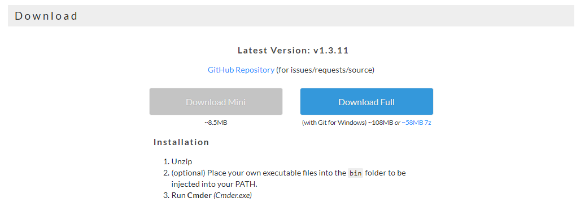
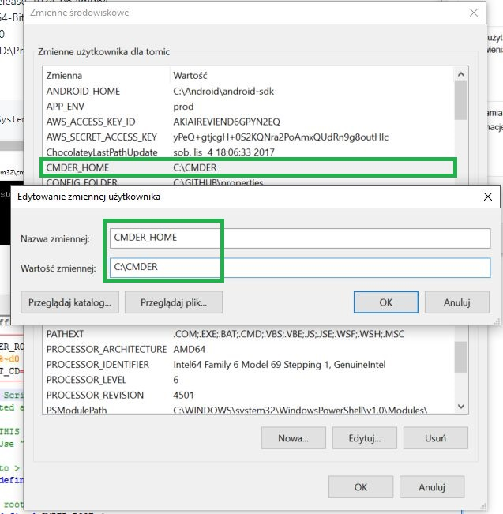

# GIT installation steps

## Linux
Install using your favourite package manager
- git
- gitk
- git-gui
- meld or kdiff3
## Mac OS X
Git will be available together with Xcode tools.
## Windows

Check out this article [Hipstering Windows](https://macyves.wordpress.com/2014/09/18/hipsterising-windows-cygwin-vs-babun-vs-git-bash-vs-powershell-the-onion-scale/)

My personal recommendation is to install one of the following tools:
* [CMDER](http://cmder.net/)
* [Babun](http://babun.github.io/)
* [Cygwin](https://www.cygwin.com/) (it is quite old, so above options seems to be better choice)

Not confirmed, but according to some opinions CMDER might be best choice.


### Installing CMDER

1. Go to [http://cmder.net](http://cmder.net/)
2. Download Full version (with Git included)

3. Extract to some location like `C:\CMDER`
4. Add new environment variable and add CMDER to you PATH
4a. Open `My Computer` and follow instructions:

4b. Add new ENV variable `CMDER_HOME` and path pointing to extracted CMDER

4b. As last step edit `path` variable and add `%CMDER_HOME%\bin` 

5. To confirm eveyrhing works fine. Open your CMDER and paste following commands:
```
cd c:/
mkdir sda
cd sda
git clone https://github.com/towczare/git-examples.git
cd git-examples
git status
```

# Connecting to GitHub with SSH

https://help.github.com/articles/connecting-to-github-with-ssh/