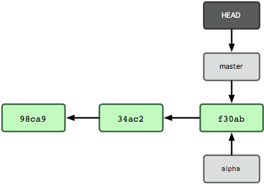
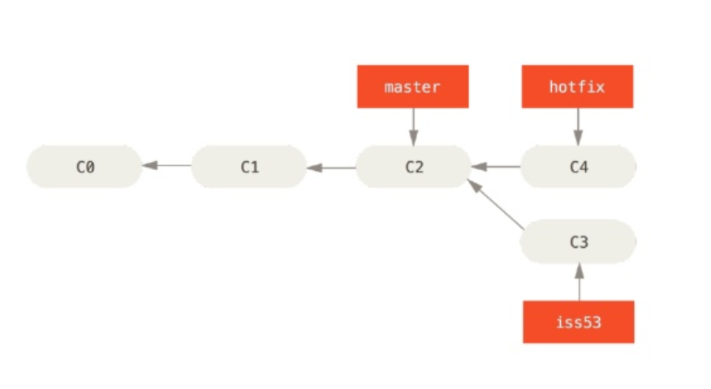
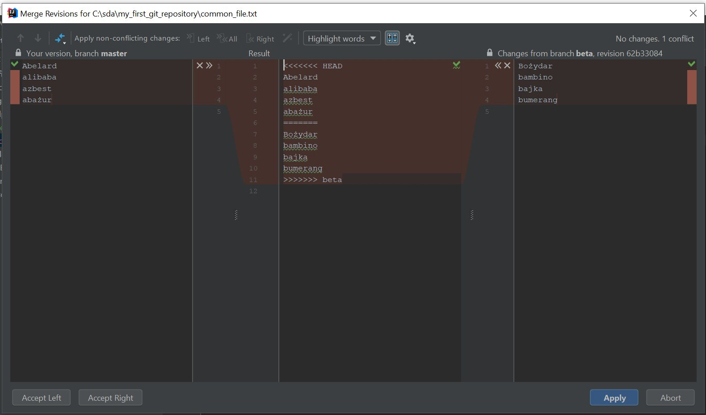

# GIT Branch, Merging 

## Commands
List of commands, we are going to learn during this session.
- `git checkout`
- `git branch`
- `gir log --graph`
## List all branches
First let's list all available branches
```
git branch
```
or
```
git branch --list
```
## Creating new branch
Let's create first branch called `alpha`
```
git branch alpha
```
now list all branches once again. You should notice, you are still on `master` branch but new one has been just created.
```
{ my_first_git_repository } master » git branch                            /cygdrive/c/sda/my_first_git_repository
  alpha
* master
```
This is how git understand which branch is currently active.

## Deleting branch
To delete branch use
```
git branch -d alpha
```
this is safe operation. Git will prevent you from deleting branch if you have unmerged changes.
From other hand here is option with force this action:
```
git branch -D alpha
```
## Switching to branch
To switch to newly created branch use:
```
git checkout alpha
```
Confirm by using once again using branch list method.

Add new file called `alpha_01.txt` with empty body.
Add new file called `common_file.txt` with following body:
```
Abelard
alibaba
azbest
abażur
```
Now add and commit both files.
HEAD pointer is going forward together with your new commit.
Now checkout to `master` branch.  

Tip: Here is nice way, how you can visualize git log graph
```
git log --all --decorate --oneline --graph
```
## More branches
Add another branch called `beta` and add empty `beta_01.txt` 
Add file `common_file.txt` with following body:
```
Bożydar
bambino
bajka
bumerang
```
Make sure to create branch while being on `master` branch.
Commit all files, and check using:
```
git log --all --decorate --oneline --graph
```
As you can see, it is becoming more interesting now. Beside branch names, it looks like this one:


## Fast-forward merge
Now, we are going to learn how to merge branches. Let's assume, we want to merge changes from `alpha` to `master`

First switch to master using `checkout` method you are already familiar with.
Now execute following command 
```
git merge alpha
```
this command means, we are going merge `alpha` to current branch we are in.
You should see something like this:
```
{ my_first_git_repository } master » git merge alpha                                              /cygdrive/c/sda/my_first_git_repository
Updating 76083a1..5829c94
Fast-forward
 alpha_01.txt    | 0
 common_file.txt | 4 ++++
 2 files changed, 4 insertions(+)
 create mode 100644 alpha_01.txt
 create mode 100644 common_file.txt
```
This is very simple way of merging, because, the one change which is needed is basically moving `master` alias forward and point to the same location as `alpha`
Execute `git log --all --decorate --oneline --graph` to see, how does it look like now.
```
* 62b3308 (beta) Added beta and common file for beta branch
| * 5829c94 (HEAD, master, alpha) Added common_file.txt
| * 60cb937 new file alpha
|/
* 76083a1 edited ignore
* 4987589 New commit
* 48c6e77 Add .gitignore and new file
* d5d2858 Initial commit
```
## Three-way merge and conflicts
The next type of merge, we are just going to perform is more interesting and a little bit more complex.
Now we are going to merge `beta` to `master`.
Execute `merge` command with correct parameters to merge `beta` to `master`
You should get something like this:
```
Auto-merging common_file.txt
CONFLICT (add/add): Merge conflict in common_file.txt
Automatic merge failed; fix conflicts and then commit the result.
```
You can check `git status` to see details. Thanks to this command you can spot file causing merge problems, which couldn't be merged.
Open file and see whats inside. This is how it does look like if you followed instructions during branch creation process.
```
<<<<<<< HEAD
Abelard
alibaba
azbest
abażur
=======
Bożydar
bambino
bajka
bumerang
>>>>>>> beta
```
`<<<...` and `>>>..` are marking which branch was containing given changes. Now it is up to you, to decide, how to resolve this conflict.
Let's assume for our scenario, we are going to keep both changes.
You can also open this file in InteliJ IDE. Main benefit of IDE or any merging tool like `meld` or `kdiff3` is ability to present conflict following way:

Resolve conflicts, add common_file and commit everything with message mentioning it is merge commit.
Here is how git log should look like. Notice new commit working as glue between branches.
```
*   b38b022 (HEAD, master) Merging to beta
|\
| * 62b3308 (beta) Added beta and common file for beta branch
* | 5829c94 (alpha) Added common_file.txt
* | 60cb937 new file alpha
|/
* 76083a1 edited ignore
* 4987589 New commit
* 48c6e77 Add .gitignore and new file
* d5d2858 Initial commit
```

# Exercise
Following exercise is going to get you hands on labs and play a little bit with branching, merging model.

*Lion is king of jungle. You are going to become king of git!*

1. Use your `animal` repository
2. Create new branch `zoo` as child of `master` branch
3. Add multiple animal files representing animals you can find in zoo. Each animals should be comited as separated commit.
   Here is some example:
   - hippo.txt
   - tiger.txt
   - bear.txt
   - lion.txt
   
   Fill each animal file body with location like `cage a82`
4. Add new branch `safari` as child of `master` branch and prepare some animals you can find during safari. 
   Fill body of each file with location like `sector X`
5. Create third branch called `freedom` as child of `master` branch and merge both `zoo` and `safari` 
   You should get conflicts to resolve, fill it with new value of country where given wild animal can be found.
    