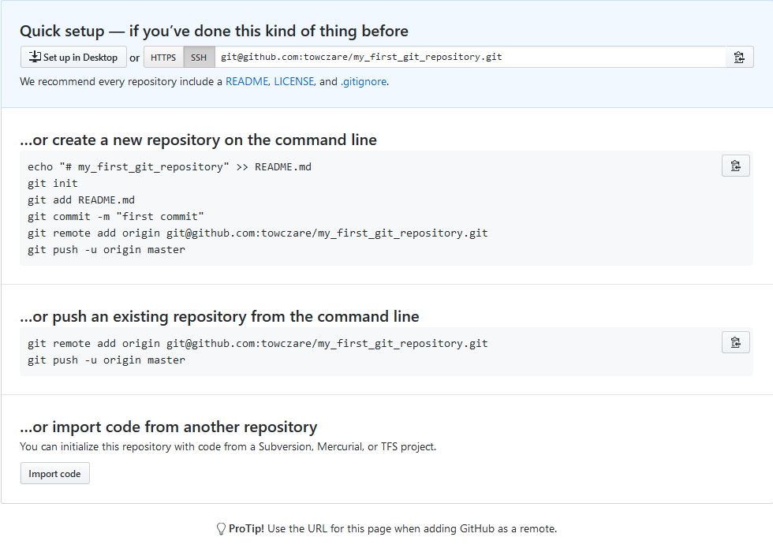

# GIT Remote

## Commands
List of commands, we are going to learn during this session.
- `git remote`
- `git clone`
- `git push`
- `git fetch`
- `git pull`

## Create repository on github
Go to your account /new and create new repository as following example

When you enter your newly created repository you should see this nice helper

## Set up your local branch as remote
Next step is setting up your remote repository. To do this, enter this commands from your local repository location:
```
git remote add origin git@github.com:towczare/my_first_git_repository.git
```
You can check all remote connections + including url using:
```
git remote -v
```
## Pushing results 
Now you can push all your local stuff using:
```
git push -u origin master
```
You can check branches. If you want to present also remote branches add `-a` parameter
```
git branch -a
```
You should get something like following:
```
  alpha
  beta
  gama
* master
  short_gama
  remotes/origin/master
```
## Cloning repository
Now lets assume you want to clone your repository on different machine.
Move to different location than current one and execute following command:
```
git clone git@github.com:towczare/my_first_git_repository.git
```
Now enter newly created directory containing all your changes pulled from remote repository.
Execute listing all branches method to see how does it look. Did you notice something missing?

## Pushing new branch to remote location
Come back to your orginal location storing all local changes.
Create new branch called `go_github_go`
Add new file `go_github.txt` and commit it.
Now time for push using:
```
git push -u origin go_github_go
```
You should get similar reponse:
```
Enter passphrase for key '/home/tomic/.ssh/id_rsa':
Counting objects: 2, done.
Delta compression using up to 4 threads.
Compressing objects: 100% (2/2), done.
Writing objects: 100% (2/2), 271 bytes | 0 bytes/s, done.
Total 2 (delta 1), reused 0 (delta 0)
remote: Resolving deltas: 100% (1/1), completed with 1 local object.
To git@github.com:towczare/my_first_git_repository.git
 * [new branch]      go_github_go -> go_github_go
Branch go_github_go set up to track remote branch go_github_go from origin.
```
Check all branches to confirm. Check your github profile, to notice new remote branch.

## Fetching, pulling
Come back to your second location and use 
```
git fetch
```
New branch should be pulled from remote location.
```
Enter passphrase for key '/home/tomic/.ssh/id_rsa':
remote: Counting objects: 2, done.
remote: Compressing objects: 100% (1/1), done.
remote: Total 2 (delta 1), reused 2 (delta 1), pack-reused 0
Unpacking objects: 100% (2/2), done.
From github.com:towczare/my_first_git_repository
 * [new branch]      go_github_go -> origin/go_github_go
```
As you can see using listing option `git branch -a` This doesn't create local branch 
```
* master
  remotes/origin/HEAD -> origin/master
  remotes/origin/go_github_go
  remotes/origin/master
```
To achieve it use following checkout command:
```
git checkout -b go_github_go origin/go_github_go
```
